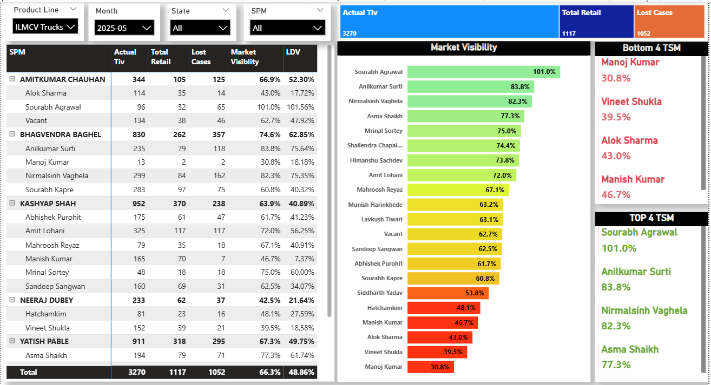
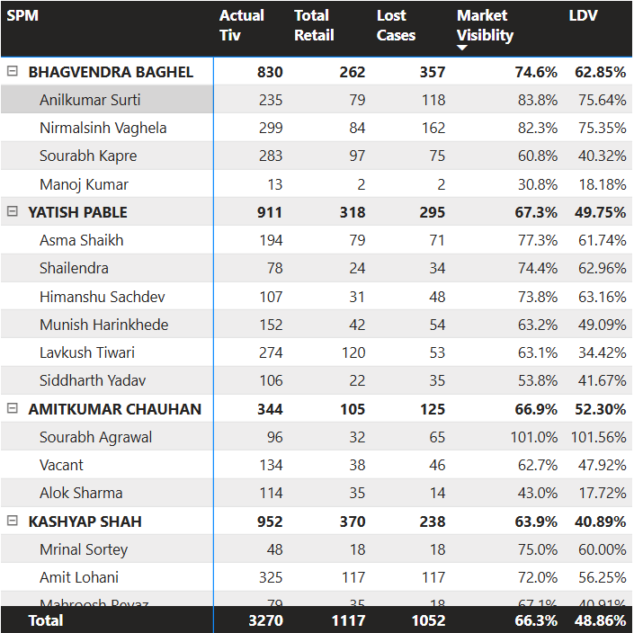

# 📊 Live Market Visibility Dashboard — Power BI

This project showcases a dynamic **Power BI dashboard** built to analyze **Market Visibility**, **Retail Performance**, and **Lost Case Tracking** across SPMs and TSMs.  
It provides real-time insights for sales managers to identify performance gaps, monitor team productivity, and improve market capture efficiency.

---

## 🖼 Dashboard Preview

### **Main Dashboard Overview**


---

### **SPM → TSM Performance Table**


---

### **Market Visibility Bar Chart**


---

### **Top & Bottom TSM Performance**


---

## 🚀 Project Highlights

- 📌 **SPM & TSM Level Market Analysis**  
- 🔄 **Total Retail vs Lost Cases Comparison**  
- 📈 **Market Visibility %** and **Live Deal Visibility %** KPIs  
- 🏆 **Top 4 & Bottom 4 TSM Rankings**  
- 🎛 **Interactive slicers**: Product Line, Month, State, SPM  
- 🎨 **Conditional formatting** to highlight performance levels  
- 🧩 **Hierarchical SPM → TSM breakdown**  

---

## 📌 Data Model Summary

The dataset includes:

- **Actual TIV** (Total Industry Volume)  
- **Total Retail**  
- **Lost Cases**  
- **TSM / SPM Hierarchy**  
- **Filters/Slicers:** Product Line, Month, State, SPM  

---

## 🧠 DAX Measures Used

### ⭐ **1. Market Visibility**
```DAX
Market Visibility =
DIVIDE(
    SUM(TIV[Total Retail]) + SUM(TIV[Lost Cases]),
    SUM(TIV[Actual Tiv])
)
```

---

### ⭐ **2. Live Deal Visibility (LDV)**
```DAX
Live Deal Visibility =
DIVIDE(
    SUM(TIV[Lost Cases]),
    SUM(TIV[Actual Tiv]) - SUM(TIV[Total Retail])
)
```

---

## 🎨 Visuals Included

- 📊 **SPM → TSM hierarchical matrix**  
- 🌡 **Conditional formatted performance bar chart**  
- 🏆 **Top 4 TSM performance panel**  
- ⚠️ **Bottom 4 TSM performance panel**  
- 🔷 KPI tiles for:
  - Actual TIV  
  - Total Retail  
  - Lost Cases  

---

## 🧭 Slicers Added

- **Product Line**  
- **Month**  
- **State**  
- **SPM**

---

## 📊 Dashboard Insights

- Provides detailed **SPM-wise & TSM-wise performance breakdown**.  
- Identifies **Top-performing TSMs** using Market Visibility %.  
- Highlights **Bottom performers** for improvement.  
- Uses **color-coded bars (Green → Red)** for quick visual interpretation.  
- Displays summary KPIs including:
  - Total TIV  
  - Total Retail  
  - Lost Cases  

---

